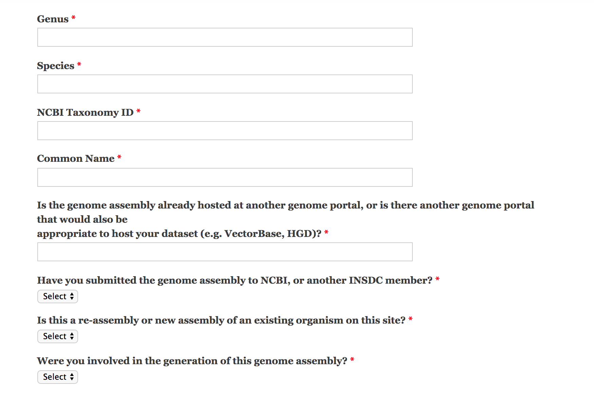
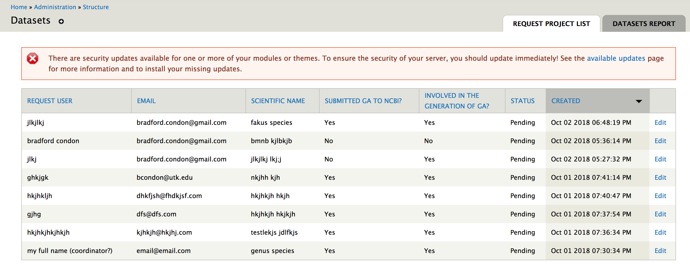

[](https://travis-ci.org/NAL-i5K/tripal_chado_datasets)

## Tripal Chado Datasets

The Tripal Chado Datasets module allows users to propose new Chado **organisms** and **analyses** to a site's database.  This module provides:

* Forms for users to request content creation
* Administrative area for approving or rejecting requests
* Creation of content after requests are approved (organism only)
* Emails confirming submissions, notifying admins, and notifying users of administrative decisions.
  

To see this module in action, pleas visit https://i5k.nal.usda.gov/datasets/submit-a-dataset 

# Set up

## Module installation

Prior to installation, make sure Tripal is installed and up to date.  This module currently supports both Tripal 2 and Tripal 3.

We suggest installing Tripal Chado Datasets via git:

```angular2html
## Navigate to your site's custom modules directory
cd /var/www/html/sites/all/modules/custom  
git clone https://github.com/NAL-i5K/tripal_chado_datasets.git
drush pm-enable tripal_chado_datasets
```

## Dependencies
the below modules will be installed when enabling Tripal Chado Datasets:

1. [Date](https://www.drupal.org/project/date)
2. [Honeypot](https://www.drupal.org/project/honeypot) 
3. [File Resumable Uploads](https://www.drupal.org/project/file_resup)
4.  [Captcha](https://www.drupal.org/project/captcha)

## Configure your site

Make sure that the site name and email variables are set for your site, as these will be used in the email messages sent to admins and users.  You can check your configuration at `/admin/config/system/site-information`


# Module usage

### Account creation

Coming soon.

### Organism request (Project request)

Users should be directed to `/datasets/request-project`.  This form will provide fields for your users to fill out to request a new Organism.  


When the request is submitted, an email goes to the site administrator, summarizing the submission, and to the user, notifying them the request was received.
The administrator checks if the organism should be approved or rejected.  Requests are listed at `admin/structure/datasets` and individual requests are approved by clicking **Edit** and and then Reject/Approve.



An email is sent to the user when the request is approved (but not if it is rejected).  Approved organisms are inserted into the chado database.

**Note**: if running a Tripal 3 site, organism records will be inserted into Chado after approving a request at `admin/structure/datasets` in the "Request Project List" tab.  They will not be available to users until they are **published**.  Visit `admin -> Content Types -> Tripal Content types -> Publish` after approving an organism to publish it.

### Analysis requests

Coming soon


### Module customization

We recommend using `hook_form_alter` and `hook_mail_alter` to customize the forms and emails sent to users.